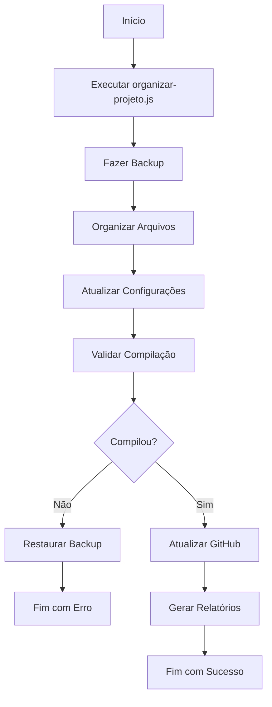
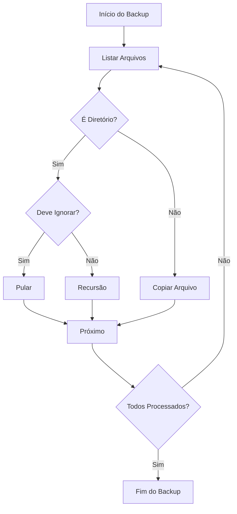
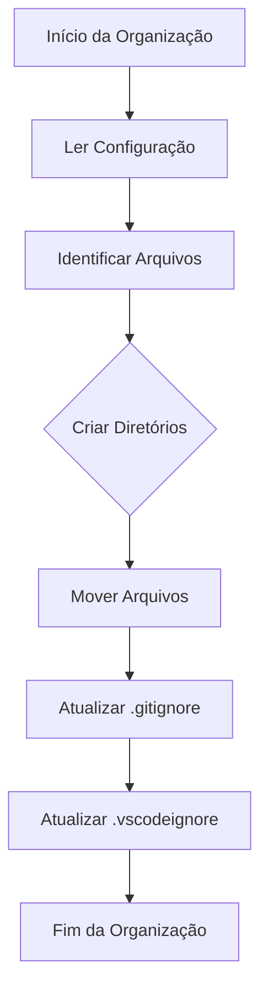
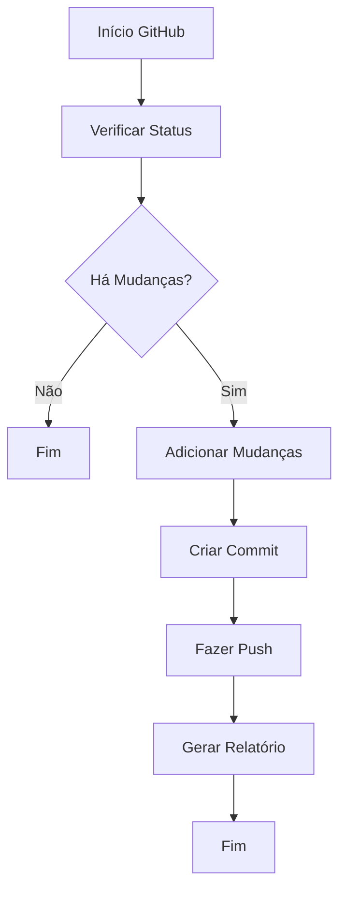
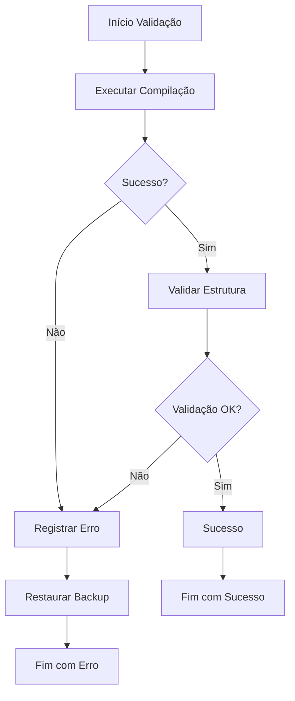
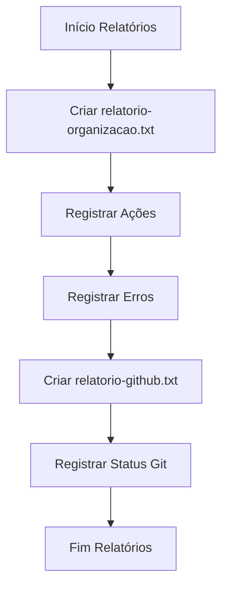

# Fluxograma do Sistema

## Fluxo Principal

## Fluxo de Backup

## Fluxo de Organização

## Fluxo de Atualização GitHub

## Fluxo de Validação

## Fluxo de Relatórios

## Notas

-   Os fluxogramas são gerados usando Mermaid
-   Podem ser visualizados em editores que suportam Mermaid
-   Representam o fluxo lógico do sistema
-   Incluem tratamento de erros e casos especiais
