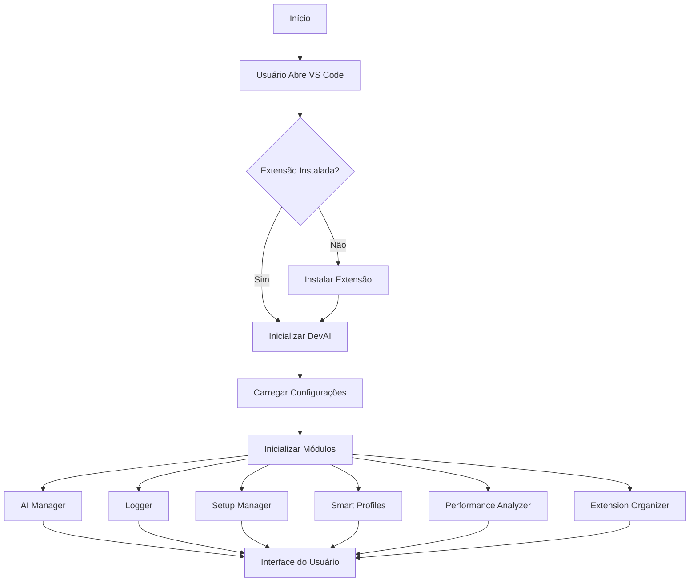
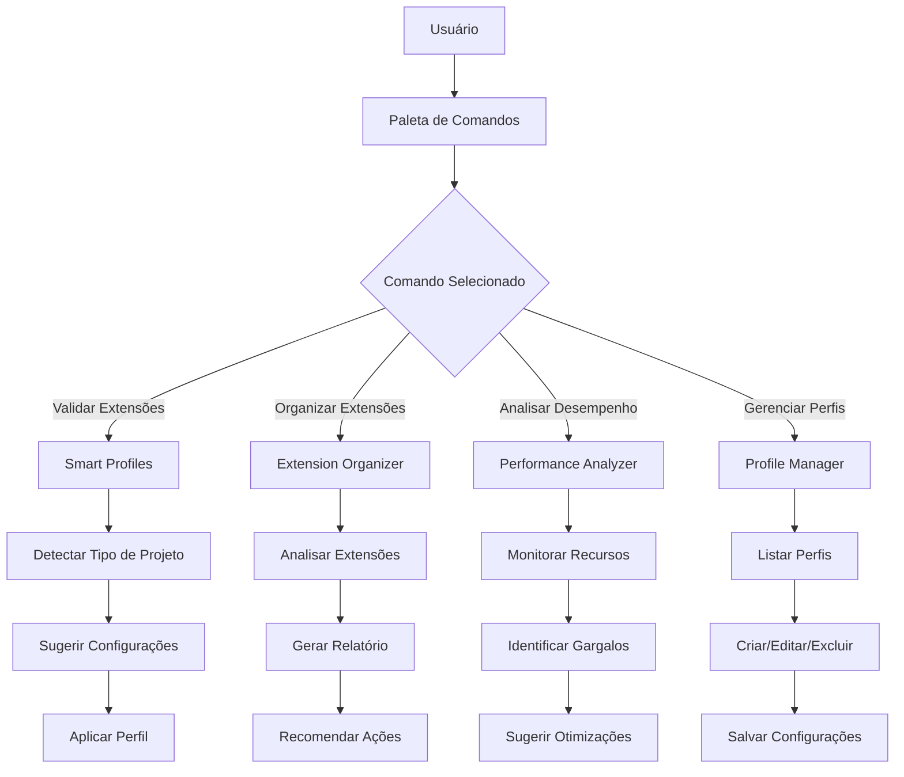
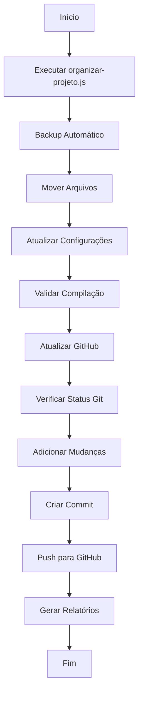
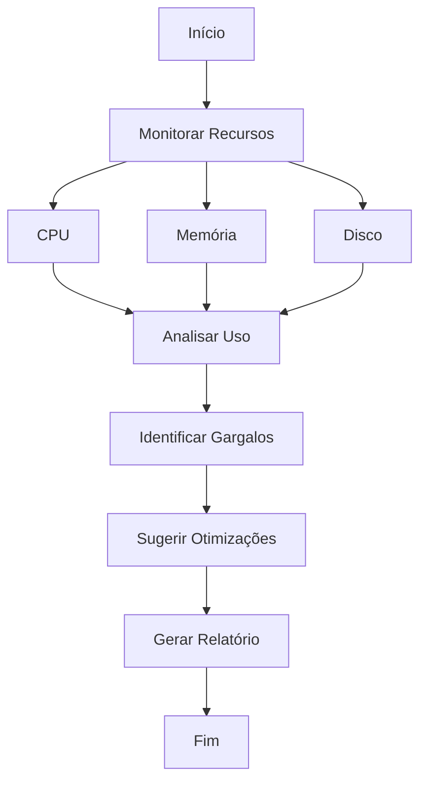
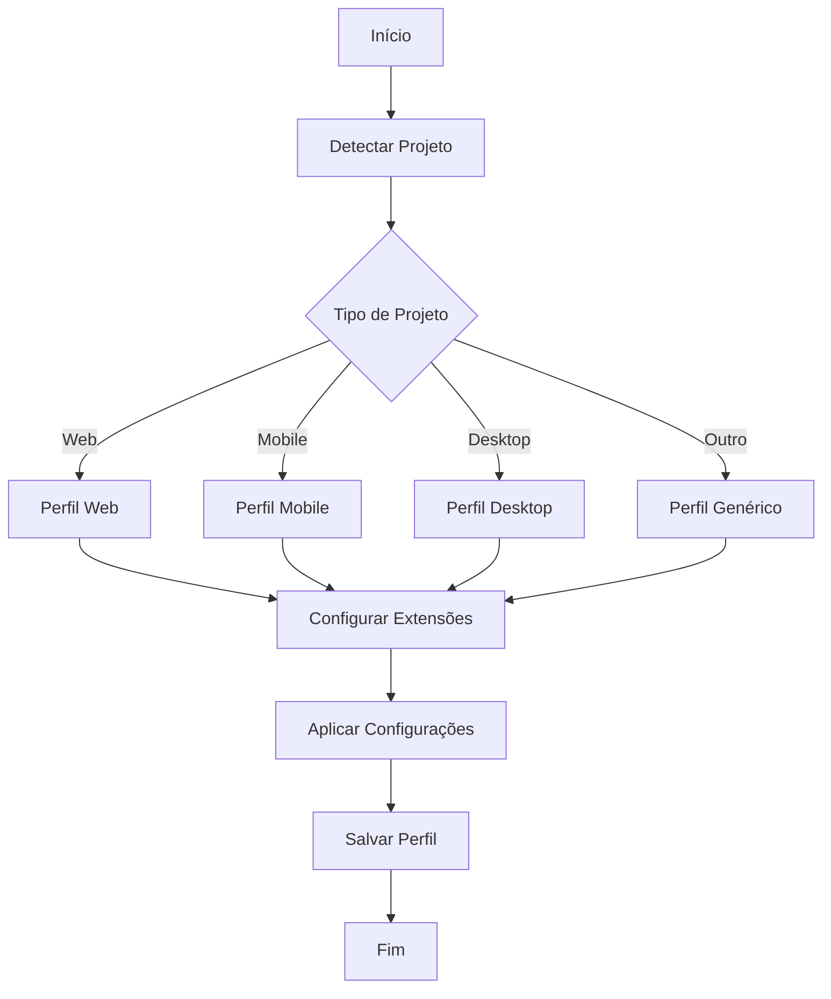
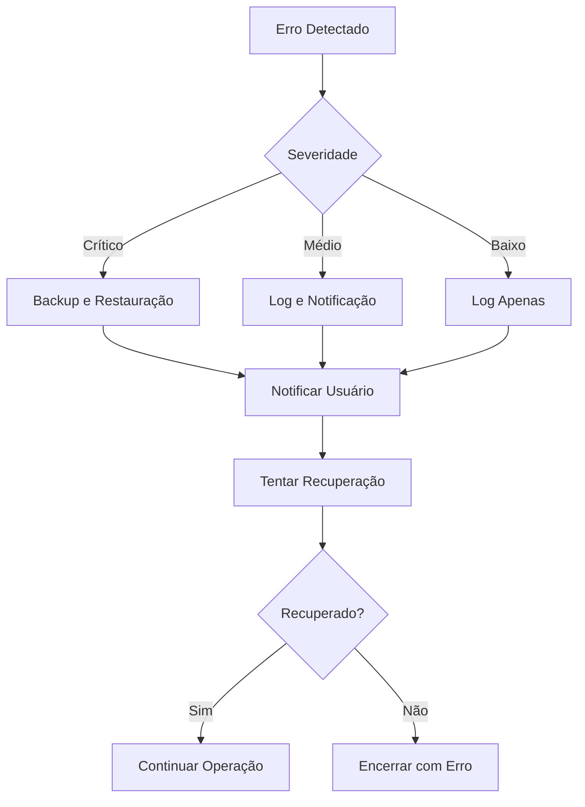
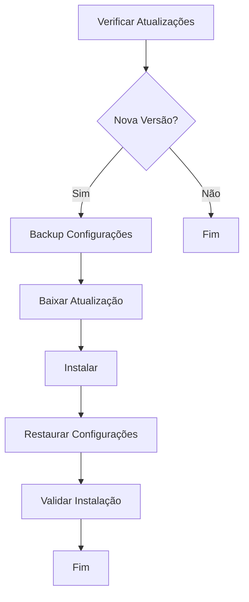

# Fluxograma do Sistema DevAI Extension

## Fluxo Principal

## Fluxo de Comandos

## Fluxo de Organização

## Fluxo de Análise de Desempenho

## Fluxo de Perfis Inteligentes

## Fluxo de Tratamento de Erros

## Fluxo de Atualização

## Notas

-   Os fluxogramas são gerados usando Mermaid
-   Podem ser visualizados em editores que suportam Mermaid
-   Representam o fluxo lógico do sistema
-   Incluem tratamento de erros e casos especiais
